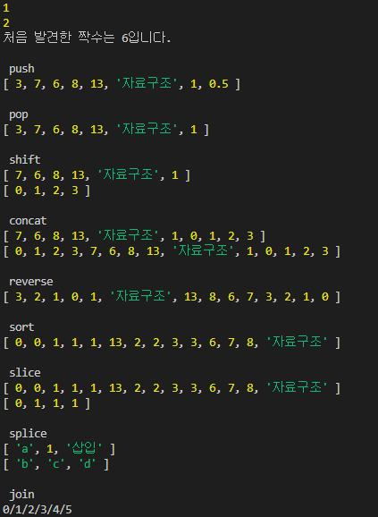

# 최기룡 [201840231]

## [5월 25일]
### 오늘 배운 내용 요약(스크립트 프로그래밍) <br />

1. express 모듈 설치
>$ npm install express@4

- 클라이언트(사용자) : 요청하는 대상
- 서버(제공자) : 응답하는 대상

- 요청 메시지 : 클라이언트가 서버로 보내는 편지
- 응답 메시지: 서버가 클라이언트로 보내는 편지

___
2. express 모듈을 사용한 서버 생성과 실행

- express 모듈의 기본 메소드
>express() 서버 애플리케이션 객체를 생성
>app.use() 요청이 왔을 때 실행할 함수를 지정
>app.listen() 서버를 실행

- 예제는 **ch10.js**파일에

___

3. 페이지 라우팅

- 페이지 라우팅 : 클라이언트 요청에 적절한 페이지를 제공하는 기술
- express 모듈의 페이지 라우팅 메소드
>get(path,callback) GET 요청이 발생했을때 이벤트 리스너 지정
>post(path,callback) POST 요청이 발생했을때 이벤트 리스너 지정
>put(path,callback) PUT 요청이 발생했을때 이벤트 리스너 지정
>delete(path,callback) DELETE 요청이 발생했을때 이벤트 리스너 지정
>all(path,callback) 모든 요청이 발생했을때 이벤트 리스너 지정

- 예제는 **ch10.js**파일에

___

4. 요청과 응답

- response 객체
- 기본 메소드
>send() 데이터 본문 제공
>status() 상태 코드 제공
>set() 헤더 설정

- 데이터 제공
- send() 메소드: 사용자에게 데이터 본문 제공, 가장 마지막에 실행해야함, 두 번 실행 x

- Content-Type
- 서버가 Content-Type을 제공 : 웹 브라우저는 헤더를 확인, 제공된 데이터의 형태를 확인(MIME라는 문자열로 제공)
>text/plain 기본적인 텍스트
>text/html html데이터 의미
>image/png png데이터 의미
audio/mpe MP3음악 파일 의미
video/mpeg MPEG 비디오 파일 의미
application/json json 데이터를 의미
multipart/form-data 입력 양식 데이터 의미

- Content-Type 지정 메소드
>type() Content-Type을 MIME 형식으로 지정

- HTTP 상태 코드 : 404 Not Found
    - 상태 코드: 서버가 클라이언트에 '해당경로는 이러한 상태'라고 알려주는 용도
- HTPP 상태 코드
> 1XX 처리중
2XX 성공
3XX 리다이렉트
4XX 클라이언트 오류
5XX 서버 오류

- 상태 코드를 지정: status () 메소드 사용
>status() 상태 코드를 지정

- request 객체
    + 요청 매개 변수
    + EX) 네이버에서 '초콜릿' 문자 검색
    + https://search.naver.com/search.naver?where=nexearch&query=초콜릿&sm=top_hty&fbm=0&ie=utf8

- 주소 분석
>프로토콜 HTTPS 통신에 사용되는 규칙을 의미
호스트 (search.)naver.com 애플리케이션 서버의 위치를 의미
URL search.naver 애플리케이션 서버 내부에서 라우트 위치를 나타냄
요청 매개 변수 ?where~~~~utf8 추가적인 정보 의미

___

5. 미들웨어

- 미들 웨어 설정 메소드
> use() 미들웨어 설정

- 정적 파일 제공
    + 웹 페이지에서 변경되지 않는 요소(이미지,음악,자바스크립트 파일,스타일시트 파일 등)를 제공

- morgan 미들웨어
    + express모듈의 미들웨어로 사용할 수 있는 외부 모듈을 확인
- 설치
>npm install morgan

- 로그 : 관련된 정보를 가진 글자
- 로그 출력 미들웨어 : 웹 요청과 관련된 내용츨 출력하는 미들웨어

- body-parser 미들웨어
    + 요청 본문을 분석함
- 클라이언트에서 서버로 데이터 전송
    + URL을 사용한 요청
        + 'http://localhost:52273/books/:id'형태로 라우트하면 :id부분을 변경해서 데이터 전달
        + URL에 요청 매개 변수를 입력하면 추가적인 정보를 객체 형태로 전달
        + URL을 사용한 요청은 주소에 정보가 남는다는 단점이 있음
        + 요청 본문 사용: 주소에 기록을 남기지 않고 데이터를 전달 가능

- 요청 본문
    + 클라이언트가 서버로 본문을 전달할 때 요청 본문의 종류를 함께 전달
    + MIME 형식
- 요청 본문의 종류
>application/x-www-from-urlencoded 웹 브라우저에서 입력 양식을 POST,PUT,DELETE방식 등으로 전달 할 때 사용하는 기본적인 요청 형식
>application/json JSON 데이터로 요청하는 방식
>multipart/form-data 대용량 파일을 전송할 때 사용하는 요청 방식

- 설치
>npm install body-parser

- 속성 정리 : 클라이언트가 서버로 데이터를 전송하는 세 가지 방법
    + params 객체 : URL의 토큰. 보기가 간편
    + query 객체 : URL의 요청 매개 변수. 토큰보다 많은 데이터를 전달할 수 있으며 주소로 어떤 데이터가 오고 가는지 확인가능
    + body 객체 : 대용량 문자열 등을 전송할 때 사용. 주소에 데이터를 기록하지 못하므로 새로고침이나 즐겨찾기 기능등을 활용 불가.

___

6. RESTful 웹 서비스 개요
- REST 규정에 맞게 만든 ROA를 따르는 웹 서비스 디자인 표준
- 웹 서비스 구조
>GET 컬렉션을 조회 / 컬렉션의 특정 요소를 조회
>POST 컬렉션에 새로운 데이터 추가 / 요소 사용 X
>PUT 컬렉션 전체를 한꺼번에 변경 / 컬렉션의 특정 요소 수정
>DELETE 컬렉션 전체를 삭제 / 컬렉션의 특정 요소를 삭제
>EX) GET /user/273 : 273번 사용자를 조회

- RESTful 웹 서비스
>GET 모든 사용자 정보 조회
POST 사용자를 추가
GET 특정 사용자 정보 조회
PUT 특정 사용자 정보 수정
DELETE 특정 사용자 정보 제거


## [5월 18일]
### 오늘 배운 내용 요약(스크립트 프로그래밍) <br />

**1.전역변수**

- 전역 변수, 전역 함수 ,전역 객체 : 모든 곳에서 사용할 수 있는 것들
> __(underline2개)filename 현재 실행중인 코드의 파일 경로
> __dirname 현재 실행중인 코드의 폴더 경로

- Node.js는 process 전역 객체를 제공
- process 객체는 프로세스 정보를 제공하며 제어할 수 있게 하는 객체
<br />

**process 객체의 속성**
>env 컴퓨터 환경정보
version Node.js의 버전
versions Node.js와 종속된 프로그램 버전
arch 프로세서의 아키텍처
platform 플랫폼을 나타냄
<br />

**process 객체의 메소드**
>exit([exitCode=0]) 프로그램 종료
memoryUsage() 메모리 사용정보객체를 리턴
uptime() 현재 프로그램이 실행된 시간 리턴

- 예제는 **ch09.js**파일

- Node.js의 이벤트 연결 메소드
>on(<이벤트 이름>,<이벤트 핸들러>)

- process 객체의 이벤트
>exit 프로세스가 종료될 때 발생
uncaughtException 예외가 일어날 때 발생

___

2. os 모듈

- os 모듈 사용, 추출
```javascript
const on = require('os');
```

- os 모듈의 메소드
>hostname() 운영체제의 호스트 이름 리턴
type() 운영체제의 이름 리턴
platform() 운영체제의 플랫폼 리턴
arch() 운영체제의 아키텍처 리턴
release() 운영체제의 버전 리턴
uptime() 운영체제가 실행된 시간 리턴
loadavg() 로드 에버리지 정보를 담은 배열 리턴
totalmem() 시스템의 총 메모리를 리턴
freemem() 시스템의 사용 가능한 메모리 리턴
cpus() CPU의 정보를 담은 객체를 리턴
getNetworkInterfaces() 네트워크 인터페이스의 정보를 담은 배열 리턴

<br />

- 예제는 **ch09.js**파일
___

3. url모듈

- url모듈 추출
``` javascript
const url = require(`url`);
```

- url모듈 메소드
>parse(urlStr[,parseQueryString=false,slashesDenoteHost=false]) URL 문자열을 URL 객체로 변환해 리턴
format(urlObj) URL 객체를 URL 문자열로 변환해 리턴
resolve(from,to) 매개변수를 조합하여 완전한 URL 문자열을 생성해 리턴

___

4. File System모듈

- 모듈 추출 방법

```javascript
const fs = require('fs');
```

- 파일 읽기
>fs.readFileSync(<파일 이름>) 동기적으로 파일을 읽음
fs.readFile(<파일 이름>,<콜백 함수>) 비동기적으로 파일을 읽음

- 비동기 처리의 장점
    + 웹 서버를 C++로 만드렴ㄴ 빠르지만, 개발과 유지보수가 어렵다
    + 프로그래밍 언어자체는 느리지만 개발 속도와 유지 보수성이 좋다.
    + 손쉽게 비동기 처리를 구현하여 빠른 처리가 가능하다.

- 파일 쓰기
>fs.writeFileSync(<파일 이름>,<문자열>) 동기적으로 파일을 씀
fs.writeFile(<파일 이름>,<문자열>,<콜백 함수>) 비동기적으로 파일을 씀

- 파일 처리와 예외 처리
- 동기 코드 예외처리: try catch 구문
- 비동기 코드 예외처리 : 콜백함수의 첫번째 매개 변수 error를 활용

- 예제 코드는 **ch09.js**파일에

___
5. 노드 패키지 매니저

- 패키지 매니저 모듈 관리 프로그램을 사용해 모듈 쉽게 설치 가능
- Node.js는 npm(Node.js Package Manager)패키지 매니저를 사용

- 외부 모듈 설치
>npm install <모듈 이름> --> 터미널에 작성

___
6. request 모듈

- 웹 요청을 쉽게 만들어주는 모듈
> npm install request

- 설치한 request 모듈 사용
```javascript
const request = requir(`request`);

const url = `http://www.hanbit.co.kr/store/books/new_book_list.html`;
request(url,(error,response,body) => {
    console.log(body)
    // 실행하면 웹 페이지의 소스 코드를 출력
});
```
___
7. cheerio 모듈

- request 모듈로 가져온 웹 페이지는 단순한 HTML 문자열
- cheerio 모듈 : 가져온 웹 페이지의 특정 위치에서 손쉽게 데이터를 추출
> npm install cheerio

___

8. async 모듈

> npm install async


## [5월 11일]
### 오늘 배운 내용 요약(스크립트 프로그래밍) <br />

**1.Date 객체**

- Date 객체 생성 방법
- 생성자 함수
> new Date() 현재 시간으로 Date 객체 생성
> new Date((유닉스 타임)) 유닉스타임(1970년 1월 1일 00시 00분 00초로부터 경과한 밀리초)으로 객체 생성
> new Date((시간 문자열)) 문자열로 객체 생성
> new Date(년,월-1,일,시간,분,초,밀리초) 시간요소를 기반으로 객체 생성
**Month를 나타내는 '월'은 0부터 시작

**객체 생성 코드**
```javascript
let dateA = new Date();
console.log(dateA);

let dateB = new Date(6313454231);
console.log(dateB);

let dateC = new Date("December 9 , 19991 21:30:00");
console.log(dateC);

let dateD = new Date(1991,12-1,9,21,30,0,0);
console.log(dateD);
```

- 예제 코드는 **07-18.js**파일에

___

2. Array 객체

> Array 객체 메소드는 **4월6일 조금더 나아가기에 있는 메소드들 설명**

- ECMAScript5에서 추가된 메소드
>forEach() 배열의 요소를 하나씩 뽑아 반복을 돌림
>map() 콜백 함수에서 리턴하는 것을 기반으로 새로운 배열을 만듦
>filter() 콜백 함수에서 true를 리턴하는 것으로만 새로운 배열을 만들어 리턴

- 예제 코드는 **07-24.js**파일에

___

3. 조금 더 나아가기

- 프로토타입에 메소드 추가

```javascript
String.prototype.contain=function(input){
    return this.index0f(input) >= -1;
}

console.log('안녕하세요'.contain('안녕'));
console.log('안녕하세요'.contain('빙그르르'));

```

___

4. 예외처리

- 예외: 실행에 문제가 발생하면 자동 중간됨.
- 예외 처리: 오류에 대처할 수 있게 하는것.

- 기본 예외 처리 : 사전에 해당 데이터가 undefined인지 조건문을 확인

```javascript
//함수 선언
function callTenTimes(callback){
    if(callback){
        for(let i = 0; i<10; i++){
            callback();
        }
    }else{
        console.log(`매개 변수 callback이 지정되지 않았습니다.`);
    }
}
//정상 실행
callTenTimes(function () {console.log(`안녕하세요`);});
//예외 발생
callTenTimes();
```
- try catch finally 구문
```javascript
try{
    //예외가 발생하면
} catch (exception){
    //여기서 처리합니다.
} finally {
    //여기는 무조건 실행됩니다.
}
```

- catch구문, finally 구문 생략 가능

- 고급 예외 처리 예제는 **08-3.js**파일에

___

5. 예외 객체

- 예외가 발생하면 어떤 예외가 발생했는지 정보를 전달함
- name 속성과 message 속성이 있음

```javascript
try{
    //예외를 발생시킵니다.
    error.error.error();
} catch(e){
    console.log(e.name);
    console.log(e.message);
    // 결과 ReferenceError
    //      error is not defined
}
```
___
6. 예외 강제 발생

- throw 키워드 사용

- 간단한 예외 강제 발생에 사용
> throw '강제 예외';

- 자세한 예외 출력은 Error 객체를 사용

```javascript
const error = new Error('메시지');
error.name = '내 마음대로';
error.message = '오류 메시지';

throw error;
```

- 예제는 **08-11.js** 파일에

## [5월 4일]
### 오늘 배운 내용 요약(스크립트 프로그래밍) <br />

**1.프로토타입** 

- 생성자 함수로 만든 객체는 프로토타입 공간에 메소드를 지정하고 모든 객체가 공유 하도록 한다. *해당 함수를 생성자 함수로 사용했을때만 의미가 있다*
- 자바스크립트는 프로토타입 기반 언어라고 불린다. 자바스크립트는 클래스라는 개념이 없기에 프로토타입이 존재한다.

- 코드 **6-16.js파일**
<br />

___

2. 조금 더 나아가기
- 값이 있는지 확인하는 코드
``` javascript
let zeroNumber = 0;
let falseBoolean = '';
let emptyString = '';
let undefinedValue;
let nullValue= null;

if(zeroNumber == null)
    console.log('은 존재하지 않는 값입니다.');

if(falseBoolean == null)
    console.log('false는 존재하지 않는 값입니다.');

if(emptyString == null)
    console.log('빈 문자열은 존재하지 않는 값입니다.');

if(undefinedValue == null)
    console.log('undefined는 존재하지 않는 값입니다.');

if(nullValue == null)
    console.log('null은 존재하지 않는 값입니다.');

```
.PNG)

___

3. 기본 자료형과 객체 자료형의 차이

- 기본 자료형 숫자, 문자열, 불
``` javascript
// 기본 자료형
let number = 273;
let string = '안녕하세요';
let boolean = true;

// 자료형을 출력
console.log(typeof number);
console.log(typeof string);
console.log(typeof boolean);
```
___
- 객체 숫자, 문자열, 불
``` javascript
// 객체 자료형 시작은 항상 대문자!
let number = new Number(482);
let string = new String('안녕');
let boolean = new Boolean(true);

// 자료형 출력
console.log(typeof number);
console.log(typeof string);
console.log(typeof boolean);
```
___

- 차이점 : 기본 자료형은 객체가 아니므로 속성과 메소드를 추가할 수 없다. <br />
>기본 자료형에 프로토 타입으로 메소드는 추가 가능하다.
___

4. Number 객체

- 기본 객체 생성
``` javascript
let numberFromLiteral = 273;
let numberFromConstructor = new Number(273);
```

- 메소드는 코드 **07.js**에 설명.

___

- 생성자 함수의 속성

``` javascript
// 생성자 함수 생성
function Constructor() { }
Constructor.property = 273;
Constructor.method = function () { };

// 생성자 함수의 속성과 메소드 출력
console.log(Constructor.property);
console.log(Constructor.method);
```
___
- Number 생성자 함수의 속성
> MAX_VALUE 자바스크립트의 숫자가 나타낼 수 있는 최대숫자
> MIN_VALUE 자바스크립트의 숫자가 나타낼 수 있는 최소숫자
> NaN 자바스크립트의 숫자로 나타낼 수 없는 숫자
> POSITIVE_INFINITY 양의 무한대숫자
> NEGATIVE_INFINITY 음의 무한대숫자

- 예제는 코드 **07.js**파일에.

## [4월 27일]
### 오늘 배운 내용 요약(스크립트 프로그래밍) <br />

### 객체

1. 배열

- 배열 선언 및 접근

``` javascript
let array = ['사과', '바나나', '망고', '딸기']
array[0]; //사과
array[1]; //바나나
```
- 배열은 요소에 접근할 때 인덱스를 사용하고, 객체는 키를 사용한다. <br />

___
2. 객체 선언

**객체 선언**
``` javascript
let product ={
    제품명:'7D 건조 망고',
    유형: '당절임',
    성분:'망고,설탕,메타중아황산나트륨,치자황색소',
    원산지:'필리핀'
};
console.log(product); //출력
```
> 키: 제품명, 유형, 성분, 원산지 <br />
> 속성: 7D 건조 망고 ,당절임, 망고설탕..., 필리핀

**객체 접근**
product['제품명'] = product.제품명 ==> 출력값이 같다.

- 코드 **6-1.js파일**
<br />
___

3. 객체와 반복문

- for in 반복문을 사용해서 객체에 반복문을 적용한다.

``` javascript
let fruit = {
    name : '사과',
    price: 1200,
    origin : '한국'
};
for (let key in fruit){
    console.log(`${key}: ${fruit[key]}`);
}
```
<br />

.PNG) <br />

___
4. 속성과 메소드

- 요소: 배열 내부에 있는 값
- 속성: 객체 내부에 있는 값

**다양한 자료형의 객체**
- number, string ,boolean , array, method ...

- 메소드: 객체의 속성 중 자료형이 함수인 속성

``` javascript
let object={
    name: '바나나',
    price: 1200,
    print:function(){ //메소드 내부에서 this 키워드 사용
        console.log(`${this.name}의 가격은 ${this.price}원입니다.`)
    }
};
object.print(); //메소드 호출
                // 바나나의 가격은 1200원입니다.
```
- 객체 지향 프로그래밍: 현실의 객체를 모방해서 프로그래밍
- 배열과 객체를 사용하면 여러 개의 데이터를 쉽게 다룰 수 있다.

- 코드 **6-9.js파일** <br />
___
5. 생성자 함수

- 객체를 만드는 함수, 대문자로 시작하는 이름 사용

**기본 형태**
```javascript
function Product(name,price){
    this.name = name;
    this.price = price;
}
```

- 코드 **6-13.js파일** <br />

## [4월 13일]
### 오늘 배운 내용 요약(스크립트 프로그래밍) <br />

### 1. 익명 함수

- 이름이 없는 함수로 즉시 실행이 필요할 경우 사용한다.

**기본형태**
``` javascript
    let <함수 이름> = function () {};
```

- 자세한 코드는 **ch05.js파일**

___
<br />

### 2. 선언적 함수

- 함수에 이름을 붙여서 사용하는 함수이다.

**기본형태**
``` javascript
    function <함수 이름>() {}
```

- 자세한 코드는 **ch05.js파일**

___
<br />

### 3. 화살표 함수

- 함수 표현식이 보다 단순하고 간결한 문법으로 만들 때 사용하는 함수이다.

**기본 형태**
``` javascript
    let 함수 = () => {};
```

- 자세한 코드는 **ch05.js파일**

___
<br />

### 4. 함수의 기본 형태

- 기본형태

``` javascript
    function <함수 이름>(<매개 변수>) {
        <함수 코드>
        return <리턴 값>
    }
```
- 매개 변수가 여러개인 함수와 리턴 없는 함수도 기본 형태에 속한다.

- 자세한 코드는 **ch05.js파일**


___
<br />


### 5. 함수의 기본 활용 형태

- 리턴하는 함수의 기본 형태

```javascript
function (<매개 변수>,<매개 변수>){
    let output = <초깃값>;
    //output 계산
    return output;
}
```

___
<br />

### 6. 함수 매개 변수 초기화

- 매개 변수를 입력하지 않고 함수 호출

    + 실행하면 undefined가 출력

- 자세한 코드는 **ch05.js파일**
___
<br />

### 7.깃 허브 clone 써서 repository 가져오기

1. 원하는 repository있는 계정에 들어간다.
2. 오른쪽 부분에 보면 code가 적혀있는 란이 있다.
3. 누르면 나오는 HTTPS주소를 복사한다.
4. 터미널에 git clone (주소 복사)를 하면 현재 있는 폴더에 복사가 된다.

___
<br />

### 8.콜백 함수

- 함수의 매개 변수로 전달되는 함수

- 콜백 함수를 사용할 때는 기본적으로 익명의 함수를 사용한다. *함수의내부*에서 실행 되기 때문이다.

- 함수를 콜백함수로 사용할 경우, 함수의 이름만 넘겨주면 된다. 함수를 인자로 사용할 때 ()를 붙일 필요가 없다는 뜻이다.

- 자세한 코드는 **ch05.js파일**

___
<br />

### 9.표준 내장 함수

- 자바스크립트에서 기본적으로 지원하는 함수

- 숫자 변환 함수에는 두가지가 있다.
    - parseInt() --> 문자열을 정수로
        - parseInt(string,진법) --> 진법에 맞게 stringd을 변환
    - parseFloat --> 문자열을 실수로

- 타이머 함수
    - 타이머 함수에서는 초 단위를 millisecond(ms)로 사용한다.
    - **setTimeout(function,millisecond)** --> 일정 시간 후 함수를 한번 실행.
    - **clearTimeout(id)** --> 일정 시간 후 함수를 한번 실행 중지
    - **setInterval(function,millisecond)**--> 일정시간마다 함수를 반복실행
    - **clearInterval(id)** --> 일정시간마다 함수를 반복하는 것을 중지
    - 실행 시킨 후에 중지 시킬때는 Ctrl+C를 누르면 된다.
- 그 외에도 인코딩과 디코딩 함수,코드 실행 함수, 숫자 확인 함수 등 내장 함수들이 있다.

- 자세한 코드는 **ch05.js파일**


## [4월 6일]
### 오늘 배운 내용 요약(스크립트 프로그래밍) <br />

### 1. for in , for of 반복문

- for in문은 객체의 프로퍼티명을 열거하는 반복문이다.
    - 여기서 프로퍼티란 어떤 값이 다른 값과 연관을 가지고 있을 때 프로퍼티라고 부른다.
    예를 들어서 문자열에 length라는 프로퍼티가 있는데 이 프로퍼티는 문자열 안에 있는 문자의 양을 정수로 나타낸 값을 담고 있다.
    - index 값을 가져오는 함수.

**기본형태**
``` javascript
for(변수 in 객체식){
    문장;
}
```

- for of 문은 반복할 수 있는 객체를 순회 할 수 있도록 해주는 반복문이다.
- 자바스크립트에서 반복 할 수 있는 객체에는 *Array , Map, Set, arguments 등*이 있다.
- 값들만 가져온다.

**기본 형태**
``` javascript
for (변수 of 객체) {
    객체의 모든 열거할 수 있는 프로퍼티의 개수만큼 반복적으로 실행하고자 하는 실행문;
}
```

+ 예제 --> 4-6.js파일
___

### 2.중첩 반복문 (별 찍기 프로그램)<br />

+ 삼각 별 찍기

- 가장 기본적인 예제로 차례대로 별모양이 찍히면서 반쪽 삼각형이 보이는 코드를 출력한다.

``` javascript
let output = ""; //화면에 프린트해줄 변수
for (let i = 0; i < 10; i++) { //i는 0부터 9까지 i를 하나씩 증가시킨다.
    for(let j = 0; j< i+1;j++){ //j는 0부터 i까지 j를 하나씩 증가시킨다.
        output += "*"; //output에 있는 데이터에 *을 하나씩 추가
    }
    output +="\n"; //다음줄로 이동
}
console.log(output);
```

___
+ 역삼각 별 찍기

- 위에서 나왔던 것을 역행으로 하는 코드를 출력한다.


``` javascript
let output = " "; //화면에 프린트해줄 변수
for(let i = 10; i >= 0; i--){ //초기 i의 값을 10으로 설정해주고, i의 값이 0와 같아질 때까지 i값을 빼준다.
    for(let j = 0 ; j<=i; j++){ //i의 값이 점점 작아지므로 i의 값이 0이 될 때 까지 실행을 하는것이다.
        output +='*';
    }
    output += '\n';
}
console.log(output);
```
___
+ 정삼각형 별 찍기

- 여태껏 반쪽 삼각형을 만들었지만 이번에는 정삼각형을 만든다.

``` javascript
for (let i = 0; i< 10; i ++){ 
    for(let j=0; j<10-i; j++){ 
        output += " ";
    }
    for (let j = 0; j< i+1; j++){ 
        output += "*";
    }
    for (let j = 1; j <i+1; j++){
        output += "*";
    }
    for (let j = 0; j<10-i; j++){
        output += ' ';
    }
    output += "\n";
}
console.log(output);
```
___
+ 다이아몬드 별 찍기

- 다이아몬드 모양이 찍히는 코드를 만든다.

``` javascript
let output = "";

for ( let i = 0; i < 11; i++){

    for (let j = 0; j < 10 - i; j++){
        output += ' '; }

    for (let j = 0; j < i + 1; j++){
        output += '*'; }

    for (let j = 1; j < i + 1; j++){
        output += '*'; }

    for (let j = 0; j < 10 - i; j++){
        output += ' '; }

    output += '\n';
}
for ( let i = 0; i < 10; i++){

    for (let j = 0; j < i + 1; j++){
        output += ' '; }

    for (let j = 0; j < 10 - i; j++){
        output += '*'; }

    for (let j = 1; j < 10 - i; j++){
        output += '*'; }

    for (let j = 0; j < i + 1; j++){
        output += ' '; }

    output += '\n';
}
console.log(output);

```
___
### 3.break 키워드

- 조건에 부합하면 반복문을 빠져나가는 함수이다.

``` javascript
// 짝수를 찾으면 break키워드로 반복문을 벗어납니다.
let i =0;
let foo = [2,3,5,4,10];
while (true) {
 if (foo[i] % 2 == 0){
    bar = foo[i];
    break;
}
    i=i+1; //i++, i+=1;
}
console.log(`처음 발견한 짝수는 ${bar}입니다.`);
```
___
### 4.continue 키워드

- 반복문 내부에서 현재 반복을 멈추고 다음 반복을 진행하는 함수이다.

```javascript

for (let i = 1; i<10; i++){
    if (i % 2 == 0) {
        continue;
    }
    console.log(i);
}
// 위 코드를 간략하게 변경한 코드
for(let i = 1; i< 10; i++){ 
    if( i % 2 == 0){
        console.log(i);
    }
}
```
___
### 5.조금 더 나아가기(다양한 함수)

+ push함수 = 배열의 끝에 원하는 값을 추가해주는 함수.
</br>

+ pop함수 - 배열의 마지막 주소에 있는 값을 제거해주는 함수.
</br>
    
+ shift함수 - 배열의 첫번째 주소에 있는 값을 제거한 후에 반환해주는 함수.
--> unshift함수 - 배열의 맨 앞에 값을 추가한다.
</br>

>push와 pop를 이용하면 stack으로 이용 할 수 있다.
push와 shift를 이용하면 queue으로 이용 할 수 있다.
</br>

+ concat함수 - 두개의 배열을 합쳐주는 함수
</br>

+ reverse함수 - 배열을 역순으로 재배치하는 함수
</br>

+ sort함수 - 배열을 정렬해주는 함수 ,*각 문자의 Unicode 포인트 값의 따라서 정렬이 된다.*
>ex) 1,2,10,20,3 이렇게 있다면 정렬은 1,10,2,20,3이렇게 된다 앞에있는 1이 유니코드 문자상에서는 2보다 앞서기 때문이다.
</br>

+ slice함수 - 내가 원하는 만큼의 인덱스값을 추출해서 사용하는 함수.원형은 보존되어 있고 복사붙여넣기라고 생각하면 쉬움.
>ex)slice(1,5) --> 이 것의 뜻은 인덱스1에서 인덱스 4값까지 쓴다는 뜻. 1부터 시작하여 5전의 값까지 사용하겠다.
</br>

+ splice 함수 - slice와 비슷하게 원하는 만큼의 값을 추출해서 사용하는 함수지만, 이 함수는 원형이 남지않는다. 잘라내기라고 생각하면 될 것 같다. 그리고 잘라낸 곳에 원하는 값을 무한정으로 넣을 수 있다.
>ex)splice(1,3,1,"삽입") --> 이 것의 뜻은 인덱스1값부터 3개를 추출해라.그리고 그 곳에 1과 "삽입"을 넣어라.
</br>

+ join 함수 - 배열 값들 사이에 원하는 문자를 삽입하여 변환하는 함수.
</br>

+ 스코프 - 변수를 사용 할 수 있는 범위
            스코프 == 블록
            </br>

+ var 키워드 - 자바스크립트에서는 let키워드를 사용하지만 익스플로러에서는 var 키워드를 사용한다. 이유는 let 키워드로 생성한 변수는 해당 블록 내부에서만 사용이 가능하지만 var키워드로 생성한 변수는 모든 곳에서 사용이 가능하다.
</br>

+ 함수들 출력 결과화면 (코드는 4-9.js) </br>



## [3월 30일]
### 😀오늘 배운 내용 요약(스크립트 프로그래밍) <br />
___
### 1.중첩 조건문 <br />

- + **기본형태** <br />

``` javascript
 if(조건문) {<br />
    if(조건문){
        문장; 
    } else{
        문장; 
    }
} else .... <br />

```
___
### 2.switch 조건문 <br />

- 필요한 조건에 만족하는 경우 각각 다른 조건을 실행 시킬 수 있다.<br />
<br />

- **기본 형태** <br />

``` javascript
switch (<비교할 값>) {
    case <값>:
    <문장>
    break;
    default:
    <문장>
    break;
    ...
} <br />
```
+ *예제 --> code 3-10.js파일* <br />
___
### 3.삼항 연산자

- 참/거짓에 따라 선택적으로 실행되는 조건문이다.<br />
<br />

- **기본 형태**<br />

 **<조건문> ? <참> : <거짓>** <br />

+ *예제 --> c3-12.js*<br />

___
### 4.prompt 기본 사용 <br />

- c-18.js파일에 코드가 입력 되어 있다.<br />
___
### 5.반복문 <br />

- console.log로 1000번을 출력하는 것에 무리가 있다.
--> <u>그러므로 반복문을 사용</u> <br />
<br />

**기본 형태** <br />

``` javascript
for (let i = 0; i<1000; i ++>){
    console.log("출력");
} 
``` 
___
### 6.배열 <br />

- 배열에는 여러 자료형이 섞여 있을 수 있다. <br />
<b> ex) let 이름 = [55 , 293, '전공', ' 겨울', true] --> 가능</b> <br /> 
<b>요소: 배열 안에 들어 있는 각 자료</b> <br />
___

### 7.while 반복문 <br />

- 반복문의 가장 기본 반복문이다. <br />
- 일정한 조건을 만족하는 동안 계속 반복하는 함수 <br />

<br />

**기본 형태**<br />
``` javascript
while(조건){
    실행내용(반복 될 내용)
}
```

### 8.for 반복문<br />

- 반복 횟수를 명확히 알고 있을 때 주로 사용.

**기본 형태**<br />
``` javascript
for(초기화식;조건식;증감식){
    실행 문장;
}
```
___

### 9.역 for 반복문

- for문과 반대로 역순으로 구현하는 문법

```javascript
for(초기화식;조건식;증감식){
    위에 초기화식과 조건식과 증감식은 for문에 따라 다르게 입력한다 ;
}
```
___


## [3월 29일]
## 오늘 배운 내용 요약 (웹 프로그래밍 고급)<br />
- 톰캣 활용하여 웹 애플리케이션 실행<br />
- 톰캣을 할때 기본 구성요소 구성<br />

___


## [3월 23일]
## 오늘 배운 내용 요약 (스크립트 프로그래밍) <br />

- 자료형을 쓸 떄 따옴표 사용법, 이스케이프 문자<br />

- 터미널에서 문자열 코딩하는 법<br />
<b>ex)
``` javascript
"올해는"+new Data().getFullYear() --> '올해는2021'
```

``` javascript
'52+273 = '+ (52+273) --> '52+273 = 325'<br />
```
- 비교 연산자<br />
- 자바스크립트의 여섯가지 자료형<br />
<b>문자열,숫자,불,함수,객체,undefined</b><br />
<br />
- NaN
- if문
<u>사실상 오늘수업 온라인으로 들었지만 목소리가 끊겨서 들리기에 놓친 부분이 많았습니다..</u>


## [03월 16일]
## 오늘 배운 내용 요약 (스크립트 프로그래밍) <br />

1.GIT HUB와 연동을 시켜서 정상적으로 repository를 GIT HUB에 올리는 것 학습<br />
2.js파일을 생성해 vscode 안에 있는 터미널을 이용해서 여러가지 명령어를 실행<br />
3.html파일을 만들어 ht 까지 타이핑한 후에 html.5를 누르면 html의 중요 명령어들이 자동으로 출력</p><br />
4.html에서 오류를 확인하는 방법<br />
5.자바스크립트의 기본용어<br />
